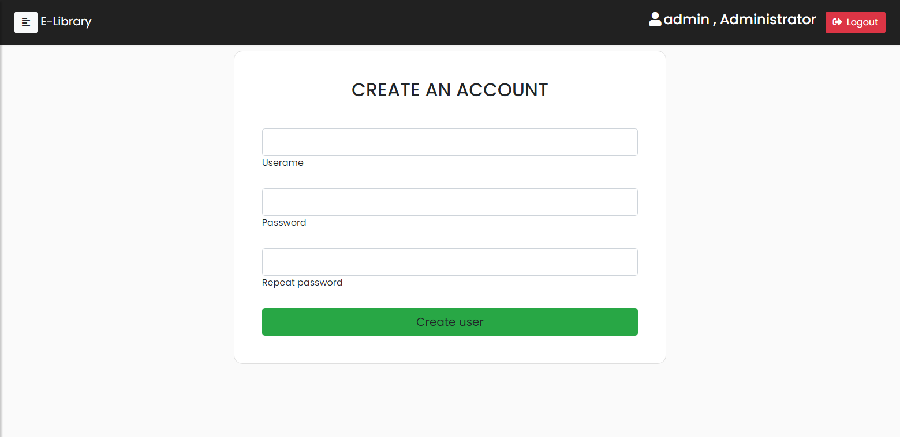
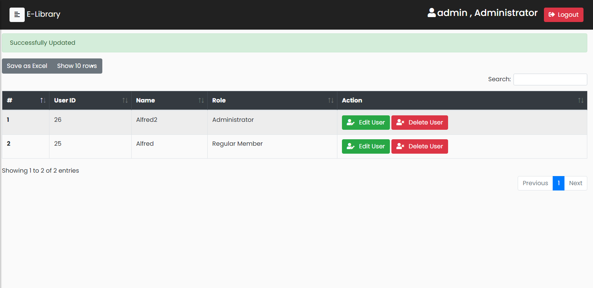

# E-LibraryPHP

Scraped from my old files

**Note:** This repository serves as a reminder from my past self, highlighting the mistakes and shortcomings I made during my early days in college, It was originally created with the primary goal of passing a semester. As I revisit this project, I've identified several shortcomings and bad practices that I want to acknowledge:

1. **Lack of MySQL Parameters:** I did not use MySQL parameters to prevent SQL injections, which is a significant security concern.

2. **Violation of DRY Principle:** The code lacks adherence to the DRY (Don't Repeat Yourself) principle. There is redundant code that could be refactored for better maintainability.

3. **No Password Hashing:** Security is compromised as passwords are stored in plain text, without proper hashing.

4. **Improper Input Sanitization:** Input data is not adequately sanitized, leaving the application vulnerable to various security threats.

5. **Excessive Use of Divs:** The project includes an overuse of div elements, indicating a lack of structuring and design considerations.

and many more. You can look at it by yourself.

This README is a testament to my ongoing learning journey. It symbolizes the mistakes made and the commitment to continuous improvement in coding practices.

## Screenshots

## **Disclaimer:**

This project used several anime pictures and texts from MyAnimeList for educational purposes only. The use of Anime pictures and their text details is not intended to infringe upon any copyrights or trademarks held by them. I want to clarify that I am not affiliated with MyAnimeList in any official capacity, and this project was created solely for academic purposes as a requirement for my semester. No commercial gain or endorsement is implied, and any resemblance to real persons, living or dead, or actual events is purely coincidental.

If there are any concerns or issues regarding the use of anime pictures, please contact me immediately so that appropriate measures can be taken to address them.